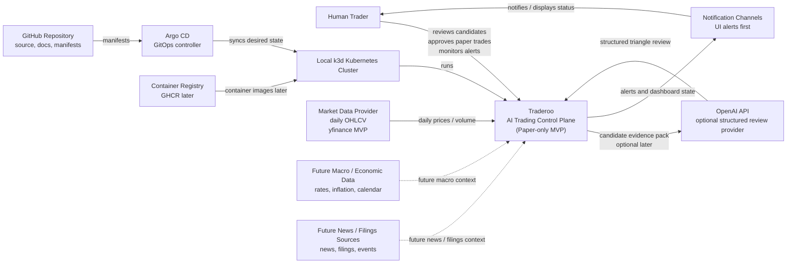

# Traderoo C4 — Level 1 System Context

## 1. Purpose

This document describes the high-level system context for Traderoo.

Traderoo is a local Kubernetes-hosted, paper-only AI trading control plane.

The purpose of the system context view is to show:

* who uses Traderoo
* which external systems Traderoo interacts with
* what data flows into Traderoo
* what Traderoo produces
* where the safety boundaries are

---

## 2. System summary

Traderoo helps a human trader operate a paper-only trading decision lifecycle.

Traderoo can:

```text
ingest market data
build features
create observations
generate candidate paper trades
review candidates
apply deterministic risk controls
simulate paper trades
monitor open paper positions
emit alerts
evaluate outcomes
show the full lifecycle in a dashboard
```

Traderoo must not:

```text
place real trades
connect to a real broker for execution during the MVP
use leverage
use CFDs
use spread betting
trade options
allow AI to execute trades
allow AI to bypass the risk gate
```

The only permitted MVP execution mode is:

```text
PAPER_ONLY
```

---

## 3. Primary actor

## Human Trader

The human trader is the operator and reviewer of the system.

The human trader can:

* view the dashboard
* inspect assets
* review candidate paper trades
* inspect triangle reviews
* inspect risk decisions
* approve or reject paper trades
* monitor open paper positions
* review alerts
* review outcome/performance summaries

The human trader is the only actor allowed to approve paper execution during the MVP.

---

## 4. External systems

## Market Data Provider

Provides daily OHLCV market data for tracked assets.

MVP provider:

```text
yfinance
```

Purpose:

* price bars
* historical close prices
* volume
* basic market data for features

MVP limitation:

```text
POC-grade market data only.
Not production-grade trading data.
```

---

## Future Macro / Economic Data Provider

Provides macroeconomic and market regime context.

Potential future data:

* interest rates
* inflation
* employment data
* yield curves
* economic calendar
* central bank decisions

This is future scope and not required for the first MVP loop.

---

## Future News / Filing Sources

Provides contextual information for candidate review and later RAG features.

Potential future data:

* company filings
* earnings updates
* market news
* central bank statements
* regulatory announcements
* sector news

This is future scope and not required for the first deterministic MVP loop.

---

## OpenAI API

Optional later provider for structured triangle review.

Traderoo may send a candidate evidence pack to OpenAI and receive structured analysis against:

```text
Signal / Edge
Safety / Risk
Situation / Context
```

OpenAI may produce advisory review output.

OpenAI must not:

```text
execute trades
approve trades directly
bypass the risk gate
change execution mode
call broker APIs
modify risk limits
```

---

## Local Kubernetes Cluster

Traderoo runs on a local Kubernetes cluster hosted on a powerful desktop.

The local runtime is:

```text
k3d
```

Purpose:

* run Traderoo workloads
* run Postgres from Chunk 2 onward
* run worker jobs
* host the dashboard/API
* support Argo CD GitOps deployment

---

## Argo CD

Argo CD syncs Kubernetes manifests from GitHub into the local Kubernetes cluster.

Argo CD deploys desired state.

Argo CD does not build application images.

---

## GitHub Repository

GitHub stores:

* source code
* documentation
* ADRs
* Kubernetes manifests
* Argo CD Application manifest
* delivery chunk plan

GitHub is the source of truth for the project.

---

## Container Registry

A container registry will eventually store Traderoo application images.

Preferred future registry:

```text
GHCR
```

This is not required in Chunk 0, but becomes relevant when the application container is introduced.

---

## Notification Channels

Future notification channels may include:

* dashboard alerts
* email
* Slack
* Telegram
* local desktop notifications

For the MVP, alerts only need to appear in the Traderoo UI.

---

## 5. System context diagram



---

## 6. Main data flows

## 6.1 Deployment flow

```text
GitHub repository
  → Argo CD
  → local k3d cluster
  → Traderoo workloads
```

Argo CD reads Kubernetes manifests from GitHub and syncs them into the local cluster.

---

## 6.2 Market data flow

```text
Market data provider
  → Traderoo ingestion worker
  → price_bars
  → feature builder
  → observations
```

Market data enters Traderoo as daily price bars.

---

## 6.3 Candidate decision flow

```text
features
  → observations
  → candidate paper trade
  → triangle review
  → deterministic risk gate
  → manual approval
  → paper execution
```

No candidate can become a paper trade without review, risk gating, and manual approval.

---

## 6.4 Paper trade monitoring flow

```text
open paper position
  → position watcher
  → watcher state
  → alerts
  → dashboard
  → outcome evaluator
```

Watchers monitor whether the original paper-trade thesis remains intact.

---

## 6.5 Optional AI review flow

```text
candidate evidence pack
  → OpenAI API
  → structured triangle review
  → schema validation
  → deterministic risk gate
```

The OpenAI review is advisory.

The deterministic risk gate remains mandatory.

---

## 7. Trust boundaries

## Traderoo boundary

Traderoo owns:

* system memory
* candidate lifecycle
* review persistence
* risk decisions
* paper execution
* watcher state
* alerts
* outcome evaluation
* dashboard state

---

## External data boundary

External market, macro, news, or filing data is untrusted input.

Traderoo should store source metadata and timestamps.

Future RAG/news documents must be treated as evidence, not instructions.

---

## AI boundary

AI output is untrusted advisory analysis until validated.

AI output must:

* match schema
* be persisted
* pass deterministic risk gate
* require manual approval before paper execution

AI must not be allowed to execute trades or modify safety controls.

---

## Execution boundary

During the MVP, execution is internal paper simulation only.

No external broker is inside the MVP system context.

No real orders leave Traderoo.

---

## 8. System context decisions

This system context reflects the following accepted ADRs:

```text
ADR 0001: Use local Kubernetes with k3d
ADR 0002: Use Argo CD for GitOps deployment
ADR 0003: Keep the MVP paper-only
ADR 0004: Project structure for Traderoo
```

---

## 9. Summary

Traderoo is a local, paper-only trading control plane.

At system context level, Traderoo sits between:

```text
external evidence sources
human review
AI-assisted analysis
local Kubernetes deployment
paper-only trade simulation
dashboard feedback
```

The core safety boundary is:

```text
Traderoo may observe, analyse, simulate, monitor, alert, and evaluate.

Traderoo must not place real trades during the MVP.
```
