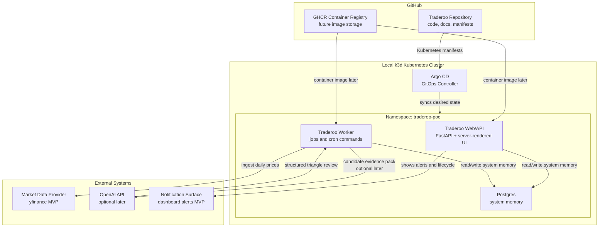

# Traderoo C4 — Level 2 Container View

## 1. Purpose

This document describes the main runtime containers for Traderoo.

Traderoo is a local Kubernetes-hosted, paper-only AI trading control plane.

The container view shows the major deployable/runtime parts of the system and how they interact.

---

## 2. Container summary

Traderoo starts as a modular monolith but runs as several Kubernetes workloads.

The MVP should avoid premature microservices.

The preferred model is:

```text id="3zryxo"
one application codebase
one backend image
multiple commands / workloads
shared database
simple server-rendered UI
```

The same codebase can support:

```text id="5k7xb8"
API / dashboard process
worker commands
CronJobs
database init jobs
seed jobs
```

---

## 3. Runtime containers

## 3.1 Traderoo Web/API

The Web/API container serves:

* dashboard pages
* asset pages
* candidate pages
* positions page
* alerts page
* performance page
* JSON API endpoints
* manual approval/rejection actions

MVP technology:

```text id="n0shos"
Python
FastAPI
server-rendered HTML templates
```

The Web/API container talks to Postgres and reads system memory.

It must not place real trades.

---

## 3.2 Traderoo Worker

The Worker container runs background commands.

These may be invoked as Kubernetes Jobs or CronJobs.

Worker commands include:

```text id="yxnjns"
init database
seed assets
ingest prices
build features
run observers
generate candidates
review candidates
run risk gate
run watchers
evaluate outcomes
```

The Worker uses the same application codebase as the Web/API container.

It must not introduce separate service boundaries until needed.

---

## 3.3 Postgres

Postgres stores Traderoo system memory.

It stores:

```text id="z3tnoh"
assets
price_bars
feature_snapshots
observations
candidates
triangle_reviews
risk_decisions
paper_orders
paper_fills
positions
watcher_states
alerts
outcomes
system_events
```

Postgres is the source of truth for the paper trading lifecycle.

For the MVP, Postgres runs inside the local k3d cluster.

---

## 3.4 Argo CD

Argo CD runs in the local Kubernetes cluster and syncs Kubernetes manifests from GitHub.

Argo CD deploys Traderoo desired state.

Argo CD does not build container images.

---

## 3.5 GitHub Repository

The GitHub repository stores:

* application source
* documentation
* ADRs
* delivery plans
* Kubernetes manifests
* Argo CD Application manifest

GitHub is the source of truth for code and deployment desired state.

---

## 3.6 Container Registry

A container registry stores built Traderoo images.

Preferred future registry:

```text id="0xxg3r"
GHCR
```

For early chunks, image building may be local.

Later, GitHub Actions may build and push images.

---

## 3.7 External Data Providers

External data providers supply market data and future context.

MVP:

```text id="b831uz"
yfinance
```

Future:

```text id="q0lkkl"
macro data
news data
filing data
economic calendar data
```

External data is evidence, not instruction.

---

## 3.8 OpenAI API

The OpenAI API is an optional future review provider.

It may analyse candidate paper trades and return structured triangle review output.

It must not:

```text id="d8fgnw"
execute trades
approve trades directly
call paper execution
call a broker
bypass the risk gate
```

---

## 4. Container diagram



---

## 5. Main container interactions

## 5.1 GitOps deployment

```text id="mlny55"
GitHub repository
  → Argo CD
  → local k3d cluster
  → Traderoo namespace
```

Argo CD syncs Kubernetes resources into the cluster.

---

## 5.2 Web/API to database

```text id="t175i3"
Traderoo Web/API
  ↔ Postgres
```

The Web/API container reads and writes domain state.

Examples:

* list assets
* show candidates
* approve paper trade
* reject candidate
* show positions
* show alerts
* show outcomes

---

## 5.3 Worker to database

```text id="5i9ikq"
Traderoo Worker
  ↔ Postgres
```

The Worker runs lifecycle commands.

Examples:

* ingest prices
* build features
* create observations
* generate candidates
* perform triangle review
* run risk gate
* run watchers
* evaluate outcomes

---

## 5.4 Worker to market data provider

```text id="8qxpvl"
Traderoo Worker
  → Market Data Provider
  → Traderoo Worker
  → Postgres
```

The ingestion worker fetches daily OHLCV data and stores it in Postgres.

---

## 5.5 Worker to OpenAI API

```text id="gr1gii"
Traderoo Worker
  → OpenAI API
  → Traderoo Worker
  → Postgres
```

This is optional future scope.

The OpenAI response must be schema-validated before being stored.

---

## 6. Deployment model

Traderoo uses a local GitOps deployment model.

```text id="5ziqrs"
GitHub
  → Argo CD
  → local k3d
  → traderoo-poc namespace
```

The `deploy/k8s` directory contains Kubernetes manifests.

The `deploy/argocd` directory contains the Argo CD Application manifest.

The `platform/k3d` directory contains local cluster configuration.

---

## 7. Kubernetes workload model

Expected MVP workloads:

```text id="uqlzeu"
Deployment: traderoo-web
StatefulSet or Deployment: postgres
Job: init-db
Job: seed-data
Job/CronJob: ingest-prices
Job/CronJob: build-features
Job/CronJob: run-observers
Job/CronJob: generate-candidates
Job/CronJob: review-candidates
Job/CronJob: run-risk-gate
Job/CronJob: run-watchers
Job/CronJob: evaluate-outcomes
```

These may all use the same Traderoo application image with different commands.

---

## 8. Configuration

Configuration should come from environment variables and Kubernetes ConfigMaps/Secrets.

MVP required config:

```text id="16z3gz"
APP_NAME=traderoo
ENVIRONMENT=local
EXECUTION_MODE=PAPER_ONLY
REVIEW_PROVIDER=mock
DEFAULT_BENCHMARK=SPY
MAX_SINGLE_POSITION_WEIGHT=0.05
MAX_TOTAL_OPEN_POSITION_WEIGHT=0.30
```

Secrets may be introduced later for OpenAI integration.

Broker credentials must not exist in the MVP.

---

## 9. Data ownership

Postgres owns structured system memory.

External systems do not own Traderoo decisions.

OpenAI does not own decisions.

The deterministic risk gate and manual approval flow remain inside Traderoo.

---

## 10. Safety boundaries

## Web/API boundary

The Web/API may expose paper approval actions.

It must validate eligibility before paper execution.

It must not expose live execution controls.

## Worker boundary

The Worker may create paper lifecycle artefacts.

It must not call broker APIs or create live orders.

## OpenAI boundary

OpenAI may provide advisory structured review.

It cannot execute, approve, or bypass risk gate.

## Data provider boundary

Market data is external input.

It must be timestamped and stored with source metadata.

---

## 11. Container responsibilities table

| Container            | Responsibility                                                       | Must not do                   |
| -------------------- | -------------------------------------------------------------------- | ----------------------------- |
| Traderoo Web/API     | Serve dashboard, API, manual actions                                 | Place real trades             |
| Traderoo Worker      | Run ingestion, features, observers, review, risk, watchers, outcomes | Bypass safety controls        |
| Postgres             | Store system memory                                                  | Store live broker credentials |
| Argo CD              | Sync manifests from Git                                              | Build images                  |
| GitHub Repository    | Store code/docs/manifests                                            | Store secrets                 |
| Container Registry   | Store app images                                                     | Decide deployments            |
| OpenAI API           | Advisory structured review                                           | Execute or approve trades     |
| Market Data Provider | Provide external data                                                | Act as decision authority     |

---

## 12. MVP container acceptance criteria

The container architecture is valid when:

```text id="3rgzxi"
Argo CD can sync placeholder manifests.
Traderoo Web/API can run in Kubernetes.
Traderoo Worker commands can run in Kubernetes.
Postgres can store system memory.
Dashboard can read from Postgres.
Workers can write to Postgres.
Execution remains PAPER_ONLY.
No live broker container or adapter exists.
No broker credentials exist.
```

---

## 13. Summary

Traderoo’s container model is intentionally simple.

The MVP should use:

```text id="9flyts"
one application codebase
one backend image
separate commands/workloads
Postgres for memory
Argo CD for deployment
k3d for local Kubernetes
```

The goal is to prove the paper-only trading control loop before introducing more infrastructure complexity.
