# Traderoo C4 — Level 3 Component View

## 1. Purpose

This document describes the main internal components of the Traderoo application.

Traderoo starts as a modular monolith. The components in this document should be implemented as clear modules or packages within one application codebase, not as separate microservices during the MVP.

The goal is to make each component independently understandable and testable while keeping deployment simple.

---

## 2. Component summary

The main Traderoo components are:

```text id="pw74tq"
Configuration
Database Access
Domain Models
System Event Service
Data Ingestion Service
Feature Builder
Observer Engine
Candidate Generator
Review Provider
Risk Gate
Approval Service
Paper Execution Service
Watcher Engine
Alert Service
Outcome Evaluator
Dashboard / API Routes
```

The lifecycle flow is:

```text id="ntb573"
Data Ingestion
  → Feature Builder
  → Observer Engine
  → Candidate Generator
  → Review Provider
  → Risk Gate
  → Approval Service
  → Paper Execution
  → Watcher Engine
  → Alert Service
  → Outcome Evaluator
  → Dashboard
```

---

## 3. Component diagram

```mermaid id="f2cgaa"
flowchart TB
    subgraph app["Traderoo Application"]
        config["Configuration<br/>env vars, settings, safety defaults"]
        dbAccess["Database Access<br/>sessions, repositories"]
        models["Domain Models<br/>SQLAlchemy/SQLModel entities"]
        events["System Event Service<br/>audit trail"]

        ingest["Data Ingestion Service<br/>daily OHLCV ingestion"]
        features["Feature Builder<br/>technical feature snapshots"]
        observers["Observer Engine<br/>market condition observations"]
        candidates["Candidate Generator<br/>candidate paper trades"]

        evidence["Evidence Pack Builder<br/>candidate review inputs"]
        review["Review Provider<br/>mock first, OpenAI later"]

        risk["Risk Gate<br/>deterministic controls"]
        approval["Approval Service<br/>manual approve/reject"]
        paper["Paper Execution Service<br/>paper orders/fills/positions"]

        watchers["Watcher Engine<br/>open position monitoring"]
        alerts["Alert Service<br/>alert creation and status"]
        outcomes["Outcome Evaluator<br/>decision performance feedback"]

        api["Dashboard / API Routes<br/>HTML and JSON endpoints"]
    end

    externalMarket["Market Data Provider<br/>yfinance MVP"]
    externalOpenAI["OpenAI API<br/>optional later"]
    postgres["Postgres<br/>system memory"]
    human["Human Trader"]

    config --> ingest
    config --> features
    config --> observers
    config --> candidates
    config --> review
    config --> risk
    config --> paper
    config --> watchers

    models --> dbAccess
    dbAccess --> postgres

    ingest --> externalMarket
    ingest --> dbAccess
    ingest --> events

    features --> dbAccess
    features --> events

    observers --> dbAccess
    observers --> events

    candidates --> dbAccess
    candidates --> events

    evidence --> dbAccess
    evidence --> review
    review -.-> externalOpenAI
    review --> dbAccess
    review --> events

    risk --> dbAccess
    risk --> events

    api --> approval
    approval --> dbAccess
    approval --> events
    approval --> paper

    paper --> dbAccess
    paper --> events

    watchers --> dbAccess
    watchers --> alerts
    watchers --> events

    alerts --> dbAccess
    alerts --> events

    outcomes --> dbAccess
    outcomes --> events

    api --> dbAccess
    api --> human
```



---

## 4. Configuration component

## Purpose

Centralise runtime configuration.

## Responsibilities

* load environment variables
* apply safe defaults
* validate execution mode
* expose typed settings to other components
* fail closed on unsafe configuration

## MVP settings

```text id="wqyj79"
APP_NAME=traderoo
ENVIRONMENT=local
EXECUTION_MODE=PAPER_ONLY
REVIEW_PROVIDER=mock
DEFAULT_BENCHMARK=SPY
MAX_SINGLE_POSITION_WEIGHT=0.05
MAX_TOTAL_OPEN_POSITION_WEIGHT=0.30
DATA_STALE_AFTER_DAYS=5
```

## Must not do

* default to live trading
* accept live trading modes during MVP
* log secrets
* store broker credentials

## Key tests

* missing execution mode fails closed or defaults to `PAPER_ONLY`
* invalid execution mode blocks execution
* risk limits load correctly

---

## 5. Database Access component

## Purpose

Provide safe access to Postgres.

## Responsibilities

* create database sessions
* expose repository/helper functions
* handle transactions
* avoid direct ad hoc SQL scattered throughout the app
* support test database setup

## Must not do

* hide domain logic in low-level database helpers
* silently mutate historical decision artefacts
* store secrets in plain text

## Key tests

* database connection works
* sessions commit and rollback correctly
* repositories can create and retrieve core entities

---

## 6. Domain Models component

## Purpose

Define the persistent domain model.

## Core entities

```text id="w8vm6y"
Asset
PriceBar
FeatureSnapshot
Observation
Candidate
TriangleReview
RiskDecision
PaperOrder
PaperFill
Position
WatcherState
Alert
Outcome
SystemEvent
```

## Responsibilities

* define table structure
* define relationships
* define status enums
* support traceability between artefacts

## Required traceability chain

```text id="j5pdv5"
Position
  → PaperFill
  → PaperOrder
  → RiskDecision
  → TriangleReview
  → Candidate
  → Observations
  → FeatureSnapshot
  → PriceBar
```

## Must not do

* define live broker order models during MVP
* store broker account identifiers
* store live execution credentials

---

## 7. System Event Service

## Purpose

Create a chronological audit trail of Traderoo lifecycle events.

## Responsibilities

* record system events
* attach events to relevant domain entities
* expose recent events for dashboard display
* support debugging and lifecycle tracing

## Example events

```text id="kn97th"
MarketDataIngested
FeaturesGenerated
ObservationCreated
CandidateCreated
TriangleReviewCompleted
RiskGatePassed
RiskGateBlocked
PaperTradeApproved
PaperTradeRejected
PaperTradeOpened
WatcherStateCreated
WatcherAlertCreated
OutcomeEvaluated
InvalidExecutionModeBlocked
```

## Must not do

* replace domain tables
* store secrets
* become the only source of financial state

## Key tests

* event is created when lifecycle artefact is created
* event links to expected entity
* recent events API returns events in time order

---

## 8. Data Ingestion Service

## Purpose

Fetch and persist daily OHLCV market data.

## Inputs

```text id="0p066k"
active assets
date range
market data provider
```

## Outputs

```text id="1fz95d"
PriceBar records
MarketDataIngested events
```

## Responsibilities

* read active assets
* call yfinance provider
* normalise OHLCV data
* avoid duplicate bars
* record source and ingested timestamp
* handle provider errors safely

## Must not do

* create features
* create observations
* create candidates
* call OpenAI
* create orders or positions

## Key tests

* duplicate-safe insert
* records source as `yfinance`
* handles missing provider data without crashing entire run

---

## 9. Feature Builder component

## Purpose

Calculate repeatable features from stored price bars.

## Inputs

```text id="0j86tf"
PriceBar records
benchmark asset
feature settings
```

## Outputs

```text id="mg7dmk"
FeatureSnapshot records
FeaturesGenerated events
```

## MVP features

```text id="4gn321"
daily_return
return_20d
return_50d
volatility_20d
moving_average_50d
moving_average_200d
price_above_200dma
ma50_above_ma200
drawdown_from_252d_high
relative_strength_50d_vs_benchmark
```

## Responsibilities

* calculate features deterministically
* avoid look-ahead bias
* handle insufficient history
* store latest feature snapshots

## Must not do

* generate trades
* review candidates
* call OpenAI
* perform risk decisions

## Key tests

* sample data produces expected moving averages
* insufficient history handled gracefully
* relative strength calculated against benchmark

---

## 10. Observer Engine component

## Purpose

Create observations from feature snapshots.

## Inputs

```text id="q7saj9"
latest FeatureSnapshot records
observer thresholds
```

## Outputs

```text id="b7lfnx"
Observation records
ObservationCreated events
```

## MVP observers

```text id="ncrlqv"
TrendObserver
VolatilityObserver
RelativeStrengthObserver
DrawdownObserver
```

## Responsibilities

* inspect features
* create meaningful observations
* assign observation type and strength
* produce readable summaries
* avoid noisy duplicate observations

## Must not do

* create orders
* approve candidates
* bypass risk controls
* call OpenAI directly

## Key tests

* positive trend observation created when rule matches
* elevated volatility observation created when threshold matches
* duplicate observations controlled

---

## 11. Candidate Generator component

## Purpose

Convert observations into candidate paper trades.

## Inputs

```text id="4x1wgu"
latest observations
latest feature snapshots
open positions
strategy rules
```

## Outputs

```text id="60do3i"
Candidate records
CandidateCreated events
```

## MVP rule

Create a BUY candidate when:

```text id="0cacll"
latest positive_trend observation exists
latest positive_relative_strength observation exists
volatility is not elevated
no open paper position already exists for same asset
```

## Responsibilities

* evaluate candidate rules
* create candidate
* link source observations
* define thesis
* prevent duplicate pending candidates

## Must not do

* execute trades
* approve candidates
* call broker APIs
* call OpenAI directly
* bypass review or risk gate

## Key tests

* creates candidate when rule matches
* does not create candidate when volatility elevated
* does not create duplicate pending candidate
* does not create candidate if position already open

---

## 12. Evidence Pack Builder component

## Purpose

Build structured input for candidate review.

## Inputs

```text id="7rfhlq"
candidate
source observations
latest features
portfolio state
past outcomes, when available
```

## Outputs

```text id="9a54es"
EvidencePack object
```

## Responsibilities

* gather relevant candidate context
* avoid including secrets
* include enough information for review
* preserve references to source records

## Must not do

* execute trades
* modify candidate state
* call OpenAI directly unless part of provider flow
* include credentials in prompts

## Key tests

* evidence pack contains candidate, observations, features
* evidence pack excludes secrets
* missing optional data handled gracefully

---

## 13. Review Provider component

## Purpose

Review a candidate against the trade triangle.

## Providers

```text id="xl0kbn"
MockReviewProvider
OpenAIReviewProvider later
```

## Inputs

```text id="pp4ej1"
EvidencePack
Review provider settings
```

## Outputs

```text id="utfbu8"
TriangleReview records
TriangleReviewCompleted events
```

## Responsibilities

* produce structured review output
* validate review schema
* persist review
* update candidate review status
* fail closed on invalid output

## Valid verdicts

```text id="qwlez8"
ALLOW
ALLOW_REDUCED_SIZE
HUMAN_REVIEW
BLOCK
```

## Must not do

* execute trades
* create orders
* approve candidates directly
* bypass risk gate
* modify risk limits
* change execution mode

## Key tests

* mock provider returns valid schema
* invalid provider output rejected
* candidate status updated to reviewed only when valid

---

## 14. Risk Gate component

## Purpose

Apply deterministic controls before paper execution.

## Inputs

```text id="1n8xc6"
reviewed candidate
triangle review
latest features
open positions
risk settings
```

## Outputs

```text id="ydgmgt"
RiskDecision records
RiskGatePassed / RiskGateBlocked events
```

## MVP rules

```text id="6l8aq9"
execution_mode must be PAPER_ONLY
max_single_position_weight = 0.05
max_total_open_position_weight = 0.30
block duplicate open position
block stale data
reduce size on ALLOW_REDUCED_SIZE
require human review on HUMAN_REVIEW
block on BLOCK
```

## Responsibilities

* enforce hard safety rules
* approve, reduce, block, or require human review
* store decision and reasons
* prevent unsafe progression

## Must not do

* call AI
* create orders
* execute trades
* override paper-only guardrail

## Key tests

* blocks invalid execution mode
* blocks duplicate open position
* reduces size correctly
* blocks stale data
* blocks `BLOCK` review verdict

---

## 15. Approval Service component

## Purpose

Handle manual candidate approval and rejection.

## Inputs

```text id="80ppgr"
candidate
risk decision
user action
```

## Outputs

```text id="ou5eyh"
candidate status updates
approval/rejection events
paper execution request
```

## Responsibilities

* validate candidate can be approved
* reject invalid approval attempts
* record approval or rejection
* call paper execution only after valid approval

## Must not do

* approve blocked candidates
* skip risk decision
* create live orders
* call broker APIs

## Key tests

* blocked candidate cannot be approved
* candidate without risk decision cannot be approved
* approved candidate calls paper execution
* rejected candidate cannot be executed

---

## 16. Paper Execution Service component

## Purpose

Simulate paper execution.

## Inputs

```text id="a756th"
approved candidate
risk decision
latest price
```

## Outputs

```text id="vjg9q5"
PaperOrder
PaperFill
Position
PaperTradeOpened event
```

## Responsibilities

* create paper order
* create simulated fill
* open paper position
* link position to candidate/review/risk decision
* enforce `PAPER_ONLY`

## Must not do

* call real broker APIs
* store broker credentials
* place real orders
* use leverage
* auto-close positions

## Key tests

* creates paper order/fill/position
* enforces `PAPER_ONLY`
* refuses invalid execution mode
* links position to candidate

---

## 17. Watcher Engine component

## Purpose

Monitor open paper positions.

## Inputs

```text id="tbrf28"
open positions
latest price bars
latest features
watcher rules
```

## Outputs

```text id="3z0myl"
WatcherState records
alerts when needed
WatcherStateCreated events
```

## Responsibilities

* calculate return since entry
* calculate drawdown since entry
* check trend state
* check relative strength state
* check review due state
* create watcher state
* trigger alerts

## Must not do

* close positions
* execute trades
* change strategy logic
* override user decisions

## Key tests

* creates normal watcher state
* creates caution state near threshold
* creates thesis invalidated state when rule breached
* triggers alert when required

---

## 18. Alert Service component

## Purpose

Create and expose alerts.

## Inputs

```text id="rt9qk8"
watcher state
risk events
system safety events
```

## Outputs

```text id="bjssfy"
Alert records
WatcherAlertCreated events
```

## Responsibilities

* create alerts
* assign severity
* link alert to asset/position
* expose alerts to dashboard
* support acknowledgement later

## Must not do

* execute trades
* close positions
* call AI
* mutate risk decisions

## Key tests

* alert created for drawdown warning
* alert linked to position
* active alerts query works

---

## 19. Outcome Evaluator component

## Purpose

Evaluate whether paper trade decisions worked.

## Inputs

```text id="cedu2y"
positions
entry price
future price bars
benchmark price bars
candidate strategy version
```

## Outputs

```text id="99gtl3"
Outcome records
OutcomeEvaluated events
```

## Evaluation horizons

```text id="r8dyjb"
1d
5d
20d
60d
```

## Metrics

```text id="5gbfem"
asset_return
benchmark_return
excess_return
max_adverse_excursion
max_favourable_excursion
outcome_label
```

## Responsibilities

* evaluate paper positions when sufficient future data exists
* compare to benchmark
* label outcomes
* expose performance summaries

## Must not do

* change strategy logic live
* rewrite historical decisions
* create new trades
* execute trades

## Key tests

* pending outcome when insufficient data
* worked/failed/mixed labels assigned correctly
* benchmark comparison calculated

---

## 20. Dashboard / API Routes component

## Purpose

Expose Traderoo to the human trader.

## Responsibilities

* serve dashboard pages
* serve JSON endpoints
* show lifecycle traceability
* allow manual approval/rejection
* show alerts and performance
* show asset-level pages

## MVP pages

```text id="n80fon"
Overview
Candidates
Candidate Detail
Positions
Asset Detail
Alerts
Performance
```

## Must not do

* directly bypass domain services
* create hidden trades
* expose live execution controls
* imply guaranteed profit

## Key tests

* health endpoint works
* pages load
* API returns expected records
* approval endpoint validates state correctly

---

## 21. Component-to-chunk map

| Chunk | Components introduced                                |
| ----- | ---------------------------------------------------- |
| 0     | Platform docs and manifests only                     |
| 1     | Configuration, Dashboard/API skeleton                |
| 2     | Database Access, Domain Models, System Event Service |
| 3     | Data Ingestion Service                               |
| 4     | Feature Builder, Observer Engine                     |
| 5     | Candidate Generator                                  |
| 6     | Evidence Pack Builder, Review Provider               |
| 7     | Risk Gate                                            |
| 8     | Approval Service, Paper Execution Service            |
| 9     | Watcher Engine, Alert Service                        |
| 10    | Outcome Evaluator, Performance UI                    |
| 11    | OpenAIReviewProvider                                 |
| 12    | Kubernetes workload polish                           |

---

## 22. Component-level safety rules

All components must follow these rules:

```text id="6cajkc"
No real trades.
No real broker adapter.
No broker credentials.
No leverage.
No CFDs.
No spread betting.
No options.
Execution mode remains PAPER_ONLY.
AI output is advisory.
Risk gate is mandatory.
Manual approval is mandatory before paper execution.
```

---

## 23. Summary

Traderoo’s application components are designed to be built incrementally inside a modular monolith.

Each component should have:

```text id="tbc3el"
clear responsibility
clear inputs
clear outputs
clear tests
clear safety boundaries
```

The MVP should prove the decision lifecycle before adding complexity such as RAG, local models, broker adapters, or live execution.
